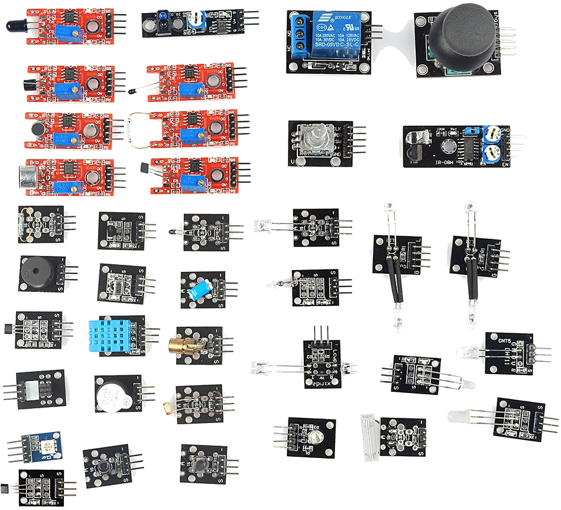

# Robotica para Educación Primaria

## CEP Ubeda

## [https://github.com/javacasm/RoboticaPrimariaCEPUbeda](https://github.com/javacasm/RoboticaPrimariaCEPUbeda)

### José Antonio Vacas @javacasm

2,3,9,11 y 25 de Abril 2019

# Alternativas

hablar sobre las distintas alternativas y dedicarles unas horas a cada uno para que sepan las alternativas que tienen y las posibilidades. Yo tengo uno de casi todos y podría llevarlos a la clase para que los vieran y probaran. Serían unas 12-15 horas
* Robot ensamblados tipo Escornabot
* Makey-Makey
* Otras alternativas
  * Lego
  * Mecano
  * Edison

# Equipos

## [BeeBot](https://ro-botica.com/es/tienda/Bee-Bot/)

Alternativa open: [Escornabot](./escornabot.md)

## [Makey-Makey](./MakeyMakey.md)

## [Meccanoid](https://www.juguetronica.com/meccanoid-g15ks)

## Lego
Lego NXT

[Lego EV3](https://www.amazon.es/LEGO-Mindstorms-juguete-electr%C3%B3nico-31313/dp/B00BMKLVJ6/ref=sr_1_1?ie=UTF8&qid=1495724987&sr=8-1&keywords=lego+ev3) (320€)

## MakeBlock

Es un mecano con corazón de Arduino.

Programable con bloques

[Recursos](https://www.makeblock.es/soporte/robot-mbot/)

[Empezando con MakeBlock](https://programamos.es/conoce-la-interfaz-de-mblock-y-programa-los-primeros-pasos-de-tu-mbot/)

## [Bq robot](https://www.bq.com/es/printbot-evolution) [100€]

## [Raspberry](./Raspberry.md)

# Problemas y sus soluciones

## El coste

Uno de los problemas que se plantea cuando se quiere hacer robótica en el aula es que tiene el coste y que normalmente los centros no disponen de presupuesto para ello.
En ese punto siempre aparece la disyuntiva de si usar un kit o los componentes

Por un lado un kit es sencillo de usar pero costoso

Por otro lado los componentes son baratos pero difíciles de usar

Una posible solución consiste en  involucrar a distintos niveles con distintas capacidades y dándoles tareas con distinto nivel de dificultad

Al construir el kit estamos aprendiendo electrónica, soldadura, impresión 3D, a leer esquemas,.... y estamos fabricando los componentes que pueden usar los más pequeños

## Posibilidad de personalización

## Externalizar servicios

* Alquiler de equipos
* Servicios externos de impresión
