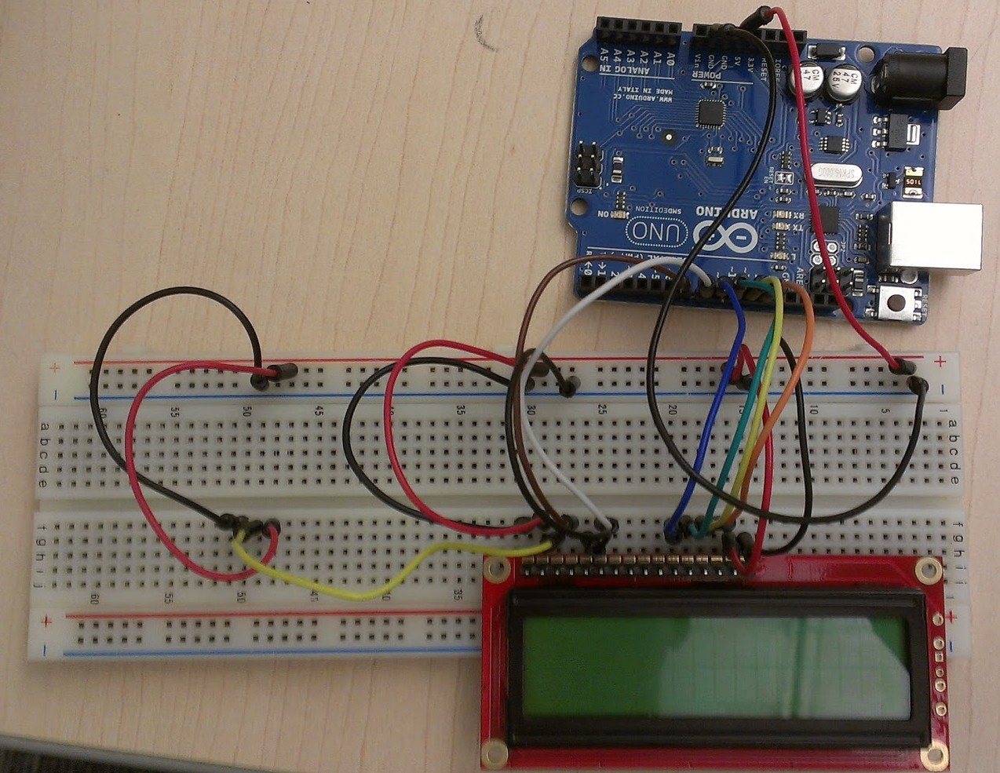

# COMO INTEGRAR LA ROBÓTICA EN EDUCACIÓN PRIMARIA. ([192320GE002](http://www.juntadeandalucia.es/educacion/portals/web/cep-ubeda/novedades/-/contenidos/detalle/abierto-plazo-de-solicitudes-para-curso-con-seguimiento-como-integrar-la-robotica-en-educacion-primaria))

## CEP Ubeda

## [https://github.com/javacasm/RoboticaPrimariaCEPUbeda](https://github.com/javacasm/RoboticaPrimariaCEPUbeda)

### José Antonio Vacas @javacasm

2,3,9,25 y 30 de Abril 2019

# Alternativas

hablar sobre las distintas alternativas y dedicarles unas horas a cada uno para que sepan las alternativas que tienen y las posibilidades. Yo tengo uno de casi todos y podría llevarlos a la clase para que los vieran y probaran. Serían unas 12-15 horas
* Robot ensamblados tipo Escornabot
* [Makey-Makey](./MakeyMakey.md)
* Otras alternativas
  * Lego
  * Mecano

# Equipos

## [micro:bit](https://microbit.org/es/)

## [Edison](https://meetedison.com)

## [BeeBot](https://ro-botica.com/es/tienda/Bee-Bot/)

Alternativa libre: [Escornabot](https://pablorubma.cc/escornabot/)

## [Makey-Makey](./MakeyMakey.md)

## [Meccanoid](https://www.juguetronica.com/meccanoid-g15ks)

## Lego
Lego NXT

[Lego EV3](https://www.amazon.es/LEGO-Mindstorms-juguete-electr%C3%B3nico-31313/dp/B00BMKLVJ6/ref=sr_1_1?ie=UTF8&qid=1495724987&sr=8-1&keywords=lego+ev3) (320€)

## MakeBlock

![makeblock](data:image/jpeg;base64,/9j/4AAQSkZJRgABAQAAAQABAAD/2wCEAAkGBxISEhUTExMVFhUWFxcYGRgWFxUWFRUVFxUXGBgXGBcZICggGBomHRgXITEhJSkrLi4uGR8zODMsNyguLisBCgoKDg0OGhAQGyslICUtLS0rLSsvLTAtLS0tLS0tLS0tLS0tLS8tLS0tLS0tLS0tLS0rLS0tLS0vLS0tLS0tLf/AABEIAOEA4QMBEQACEQEDEQH/xAAcAAEAAQUBAQAAAAAAAAAAAAAABQECAwQGBwj/xABBEAABBAECAwUGAwYDBwUAAAABAAIDEQQSIQUxQQYTIlFhBxQycYGRobHBI0JSYtHwFXKSQ1OistLh8QgWJTNz/8QAGgEBAAIDAQAAAAAAAAAAAAAAAAECAwQFBv/EADIRAQACAgEDAgQEBgMBAQEAAAABAgMRBBIhMUFRBRNhcSKBobEUIzKR0fBCweEz8RX/2gAMAwEAAhEDEQA/APcUBAQEBAQEBAQEBAQEBAQEBAQEBAQEBAQEBAQEBAQee+0ntnJjOGPjkNkLQ576BLAfha0HbUauz0rzW5xePF/xW8NbPmmv4Yc3HPxT3NmfFlzPFvEjSdWgNeRrDDYLa57bfLlnmMPzPlzEMUTk6OqJd77P+1BzoXawBLGQH1sHAjwvA6XRFeYK1ORh+Xbt4lsYcnXHfyj+Ke1PBx5pYHsyNULi15bGHMBHWw7l9FrsyTl7dYYbiPa58jcx/dxOY3YP1BpDw4gtomjtexQdMgINXifEIsaJ00zgyNgtziCQBYHTfmQgyYWUyWNksbtTHtDmu38TXCwd9+RQZkBBG4fHseWSaKOQOkx671oDrYTdA2KPI8kGHsr2jh4hjjIgDwwuc0awGutvPYEoNjhfF45y4MDvDXMUCDyI35fOjugkEBAQEBAQEBAQEBAQEBAQeHdqeKGHi08xYyQNcGljwC1zO6a0t35bXuPP5g9XFj6sMR/vlz8lunJMuxnMOFgw5UUc+lneOjidqbpOR+7Mf920+fPw9aK1Y6smSazMff7ezPOqUi0f7tCex/ILsvI5DXHqIaA1oIkHIDYDxHZZubGqQpxp/FKCPHnYmfxrTiy5He2w6GlzIwO88UpANM8X4Fc5uMPDsRseNwLTK2TVmueS26a50sVsN76h19bUDqcTtTmHG448zkuxZZWwHTH+ya10gAHh35D4r5KRH8Q7ZZT28MgdnDEE+K2fIyXNjslwdpA1DS23MPKviHlRDRyuN5ebwnPY/LEnukwBkaxlZeO40wEig3xDVqHQAb7khJf4jnY2BwvFiyv2mc5gbKY2Xjwd3EBE0cnEax4jud+XNBnx+1mdhO4rjTTDJfiRMkhlexrTb2soPDasAyM9djvuKDFwzjXEsZ/C5Z805EfEdIdG6ONvdGUMLS0tA5d4PIbHbfYMXs94dlDinEdWWXdyQJ/2TB70XMlDSf8Ad6Tv4efJBzPBM7Pw+Bx5mPl93HHOWiERsOsk+IyPdZO45ADb1QfQWJjsaLYxrS7c6QBZ571z5lBsICAgICAgICAgICAgICAg8b7bgYfFTO+FsrXgSMa+wwvDAy9uelzbr1+RXTwfzMPTE6aOX8GTekvgdoKwYsvKmLiX5IdDTT7yXHSIyDsI2gfSh50cVsX8yaUj27+zJXJ+CLWn3/Nb7HsMukycjSGsNRtAvSCTrc0E7kAaPup5tu1ao40d5lDY/EcrA4lxSQcOy5xkO0xmOGQxnSXkEu00WnUOV8loNto8M7J5eNDwlr4ZC734yva1jn9ywmBo7wtBDNmWb5WfJQMsrMmEcbxPcsqR+VLK9j2Rkxd2XPdq1/veFwprbJO1WpF83CZMc8Iy58KXIgjw2wTRCEyPjeGvrVER5yda+E9asJaDBy8nhPET7izH71x93hjhEMz4mODgXtG7n1YHKyDXMII7KdkS4fCspmHk/wDx0rY5YjGRK5rWQ3IxnNzPBXLrvQBKC+Pg+VxGTjGWzHlibkQsjgbO3u5JHRtjsaTyvuhvy8Y8igx8M94zZODYww8mL/D+7M8k0To4x3QjHhced93sOfiG2xICZ7PmbG41xCOTGnLcwh0crWEwgMjkfbn8hd6dt72Qcv8A4Jlf+2O492n773i+67qTvK1c9Faq9aQe7Qjwj5D8kF6AgICAgICAgICAgICAgII3jvAoMxndzs1AG2kEhzT5tcNx+qvjyWpO6q3pFo1LmGey7DsapMhzW3TC9ukAmyBTQQLPQrY/jL+kQw/w1fq7Hh+DHBG2KJgYxooNHL/ufVatrTadyzxERGobChIgICAgICAgICAgICAgICAgICAgICAgICAgICAgICAgICAgICAgICAgICAgICAgICAgICAgICAgICAgICAgICAgICAgpaCqAgICAgICAgICAgICAgICAgICAgICAgIKWgICC0vHmgqCgqgICCqAgICAgICAgICAgICAgICAgICAgogskfXNEtbvzagU94Pmg1J8zoCgxtzT6FBsQZxJrf8ANBte8EeSkXjJCDI2UHqiGRAQEBAQEBAQEBAQEBAQEBAQEFEGKaYN+aJaE8181VLBLPQRLQOd0UqsJcD1QKrqUGzBkaUGZuWSg2GzBQlnjnFoSkI32rKr0BAQEBAQEBAQEBAQEBAQEBBq5OW1m17olE5UvivUTamKdXiVZt0+YYjJrNN+trFFbRPeWSbRMdoYnxOJIqyPJW0hrmL0UoYHQoDYyORKDIC4evzQZmEoM8dqEpCEBnqT+CDbimI2/v8AvdTCJboUoEBAQEBAQEBAQEBAQEBAQamVlBpLdhQBJJrmSB+RQReVR3A381asR6otv0a73F2xpo8/ksXy61tuF+q0xqVAwuGhoaQAPF1/vorIZWtHJoc2iLIPl8kFzTuAxwok3qH6n7oKGIfAGh216gfxQYpo2DanahV3y9UGNsBIsBRF6ROrSTF9brDZxcQnmPor2iv/ABlWs2/5Q242aLFAu/AKi6J4vPPCx7o2a3hriLBI1aTV/UDZRsR/s34hnTxOOY1zZNZ062hh0BoskADbVtZCmEO8VkMc8wY1znGmtBJPkALJUxEzOoRa0VibT4hy/Y7j02TNOH/AA1zBQGkEnw7c6Gn6rf5nGrhpXUd/X6uP8M5t+Tkv1T29I9nWBc92VUBAQEBAQEBAQEBAQQHG2/tH+sLf+F7/APqQQEQfpDm2B5g+XyUpbMMr+7c47kOAF+XNQQxtzehb9k0NyHOHRxbvagbMWRY0jSbv5oKl7a0trVXMPF+uwQWtgJ539eqpa/TPja0Um0NjGxDe9+lFZLTS8b6VKxavmWl2j40MJmoHW+j4bBINEjbpdfVEuF7M+0dwAGTpMv75aXBpJ5hpcS2x6GrJ9FS20xpKcS7Vyu7jIjjPupcWSscPGGulEbZwRdNBI/1eiVpruTb0SXst43Ll+8ySUN2aWjkxtyDSD15c+qrS0za0JtGqw7wlZVHJ9veKBsAia4XIacQdgxu5BPqaH3W/8PxxbLufRyfjOe2PB01ie/7Ij2al4mla4g1E26FeLUC78wPoVs/EpmccT9Wl8FrSma0V9Y3+vZ6GFx3o1yAgICAgICAgICAgxzShosoOalnMkrtIaAWnW489gAGgcxte+wUJazJK2aNh0aR+SkXZJf3V6XG3XsCVAgpMjxeXopiBIwDUFAxTzFuzeaDQxJXuBfEdTdwXNotsdLCDcdnyRjc/bb8qU62JDh3G3lj3Xu0D5bk9fomh5rHmOnyJ2zzFwbLI4eEcg7aNp2JIaOvltsN2h5/xvhpjkIZIS3TqIPOME00OPI35JpDYj4rIYXQyyks06R1c0XYDfMen5LLXLatZpHiWDJx6XyVyT5r4TfZLtu7BaGRyAWACacC6iSLaWFvU/vKvH+XS1pvXe/0RyqZslaxiv06+m9tjjftJysn4n03o1uw+ZrmVW2pmddoZscWisRadz6yj+H8bmeSW2fW1Gl9u07P9rZMORrpA06xRBFEtsGg7z5c1eb310zPZjjHji3XERv3ezYOU2WNsjDbXgOB9D+qou2AgqgICAgICAgICAgxztsdfoggMzOiq2ua6wa0ubZHX5qEuY4jjNbsJmgmviBuyR0F7bHdXitlJvWO0yx40k4oiyOpa/evSlEwtEw3znvPxAH+WRoca9Cqpb7ZI+7Dqa3Vz0uOxv+FBgOiwQQT67fnsmhocH4QzDjc1ltYXOkouJ8Tg0GrPoOSCI47PNIWhuqrvYfmRz+SmJGXA7xsU1g/BflyUjz7j47vJDohZlkPhHWS219TqLT8gmldt7tRwXHZgh8kzS/vTbWneWYbSEkb6YxTGgdS7zCzRWKz+OGC15t2pPq4YcNL960jo3yHr6rPTi9Ubt2YL8uKzqO6Pzcfu3ht2ea1suOKTps4MvzK7b0IFLEzPTfZf2aGQHSuH7Nn/ABv6D5Abn5hEt32o9nWxwPlZq8JDhfSvi/BTKvh13sY4iZuHNBNmN7m/k79SoWd6EQqgICAgICAgICAgsmcA0kmgAST5Ct0Hz1w7IjZBLEJQHOlEjSA9o+Eg+KhR+Fa+bHa1omvoy0tWImJV4TLliIF5e9wLrdqEvXbxtJ6V1Xc4tcFscRae/wB3n+ZblUzTNInp+22R3G3M+LavIkG/l5rJl4tIr1dXZTDzck26Zr3+jqcDKytALmvFi9LtLiB6i7v0Xksnxjh/MmsW8eup1L0ePj5emJmFMrjYYQ2RjbdyG7Sa8gt3jZ6Zu9LRMKXiaeYIOK479iXRVvqJtvlVcxzWz0yp1Ql8fJgdUZyIydN7WeZI5gUeXntSiYlO4bGPwxocHVE+j+80PNE8vFdfSrVdLbQnbrjYx4HRs2J5nqeu1/3+t6qTLxsZUs0gkvTpPgokaa5EHzve1nxYbX7tbNnrjjTPFC0UT4iOV8h8h0W/TFWs7nvLn5M9rRqO0fRtsPXos22rMT4clmS95I53rt8hsFxsluq8y7+GnRjiq6OVxIaOZIA+ZNLGyvq7sdwf3TDhhoWGgu9Xu3d/T6KUuU9sfeDFNEd2Q8OHUu0236bFTHhSfLH/AOn0n3Gb/wDc/wDI1VXeqBEKoCAgICAgICAgIIjtJxmLGiJkNlwIawfE7avoPMrNgwWzW1X+7V5XLx8avVb8o93lfZzsJJINeQwsYQCA4lriPkNweXNYp7NqO8bRnbXFnxu70tPcRvYWtOkRv0uB0OIF06qvlvug2OGS4mTolaJ4js6o5hIxp2bRbO3wFpFmiD4r3tVtWLVmtvE+hHadpbI4g6Jsj25DZGsBIbLGY3u8VAB7TpJI9OnS1ysvwXiZP+OvtLPXk5I9XB8T4Q7iUzpTLI0gWdTWvijaOQBBbXyokre43Gpxsfy8cdv3+7He83ncqOwIY2huPlSZExBHda2RaDROupAe9A28LQDVm1s1ntG/zYZie5wqaQgu72GQN+N9aImdfFOaaT/Kxrjusm/ZGnfdkO1oyHyRR6X920O1+INdvRDbokA9SBa0OTmnF3beHH8xx/abEnyZHZee7uoNREMTT45q2BY03TTQJkdtyoGxfQw4t/VoZM3bfhzkcXkKHlzr6rqUpqNOVkybnbexOHueaAWauKZauXkVpG5aPEpQwvaLIaHbgXuBzPkLoX6rV5OT5faG7w8XzNTP3QGJGNJd9FynaTns54YMjieNGRYEms/5WeI/gEIfU7nb0oS8p9tXFP2ToQKDQCT5l2w+1n7q2uykz3TnsJxSzhYcf9pLI76Aho/5VVeXowRC5AQEBAQEBAQEGnxbLMUT5A3UWiwPM8lkw067xWfVr8rNOHFbJEb081z2ZbDPmSs1vjglkjJp8YexpLNhtpbu6vRdTkXx0wdGKf8ALgcGuTNy4yZ437e30ct2S7cZbtQlyHSuslzJS2ns03TeWl13Wn02PJcZ6hJe0/jbp2xxhlNexrm9La/lQ6Haj5UVaES4LA7yJ5LJHgb+FpOknq4jkdgd66oOz7O8Eys7u3TPDcZp2e8tDpSKGhhNaqrnvvfVQO34z2QMkDosdrQ5o5urc+V+v2Ux9SXgXG+GyQTkFpikjf4m/wALxuHN8gfw+u0SK8ba6SZ7HE6GyP0MGzQC41QHX1W5TFF4hp3yzSZdJ7NZ2QZj2FwAMJHPbVrYa+dLmfFsOoiK+jd+HZtzu3qwcY1Omfbi4Nc4NskhrdRNC+QsnZd7h0/k1n6Q4XJyfzLR9ZX4GE57g1oslb1auflyxWNynOKacWIxsNyEeJ3l6BZJnpruGhirOfLE28R6PPs137J/98yFyM0/gl6fDH8yqGjeRsFz5dOHpnsDxtWe95/cicR8yQ38nKEvoFxUJeGe3LijXvjjab6Guukk193D8VM+FfV672E4b7tw/FhPNsTb/wAzhqd+JRMuhCgVCCqAgICCiCqAgxyyhoLnEAAWSdgB6lTETM6hE2isbl417SPaK59w4ri1gPieNnP/AKD0/sdTHx/k16rf1ft/64+XP/Ez0x2p+/8A5+7W4XxJ4pzXEfkfQjkR6Ls2pTLXVo28x+Lj5Oqk6mEVxDsvhPc0sndjPe6msMbpGA+TCw3XkDVcrK4PI+HXx2/DMTEvU8P4vTNSeqJiY867/wBmHta8a4o26jHDCyNjn7vkDSS57vIlzjt02Wvn498ExFm5xOZj5VZtj9J1/v3ROHJpdfoR1vcehHPl8iVrT47NyG125yy7IxZ/jhEEQj56R3fhmaAf3tYcT56m2keEO+9mPab4mGS2Br3gOcSWNbu4C9w0NN10o1VlTETM6gmYiJmXGdvOJx5WU+RraGzR/Np/ed6k/kr2jpnSlLTaNy5zNc9uQ57Wh3wnxDY20H9VvYYt0R0tDPNJtMWlZkMyJpO9fQNVttQ6AKZ4t7TthnkY4jpT0OCZC2rLjW3rVLpYsfTWIcnJniJnbqGRMw46sd66g538F7aR6rLERPf0/doXtbJbX+x/65rjh8JUZvDb4cfihx2cba+hV1t5UB/RcLommOYnvL0dbROSJRuOxa0t2Hq/sIcG5Uw6mI/g9iiVntE8wAP9/wB8lA8LOC3iXGgxguCOTfqNEZt/3dY+yn1IfQMaDO1BeFAICAgogIKoKFB5z7TeL1JFju7wQneTu93G7DR99h9fILq8HHEUm8efr6Q4fxDLa+X5X/GP1n0j8vLyntHgjuBIyJ0YjcYpC8+N0p8Q8HNtNWxlndZ7/X8mPj9r9/8AdefskeBzWxv+Ufkt7DbdIcjm01efunGsB0kjdpsHq0+YPQrNalbRq0bc+uW+Kd0mY+zBxTBErKrdu4/UfUfotflceM1Nevo2fh/NnjZer0ntP+fya/aDBxnyxSVHjstjHMjabczVRlcR4WO0mzYvw/fzGXDmxxO6y9xh5ODLrovE/m3MDgjSY45GsZBKXufHkP1CMx6R3sUrKIDg4C+R62KrFFq9tW3239vpLJjta2911qdff6wh5cqDGdPDi45ZI8GJ0z5HPuJx8QhBY3SDVEkE7fVZccWmY6fKMs1is9Xj1Vi7Ptc23vdqPy/VduPhePpjqmdvMZPj2WLzFKxr82yzgLTzf5DcHoKHmtynHildQ52T4le9ptMeVczghjY6TU0taLNEX9uaiemvlbFntktERHeUjweWKKHvGeKR171/9Y/UqNxaOrf4f3VyRfr+Xr8XjXt/7+yC4/NqDKN+MPPnQNWfqVXPk3NYr4bHCwzXrm0a7aY+LMsFZMvhHGnUojhfBe8JL/g3FdXE/oFxOTk6J6YeiwV6oizmp8N0Mjo3iiD9x0I9CtLe3Rh1vs24r7tlhxNBwLSfIHa/oaP0Updv287VFje6hlLpSKtpsMB5uJHN3kFE6QmPZL2a93h71wp8gFeYZz/Hb6AIs9JjaoQzAIKoCAgIKICCqC0oPKuJ8ZLc/v5nAYrZQwt2Li+KNz2HTzrWdjytdf5OsPTX+rUfq4FOTFs3Xbxuf07f/jje03d502qBr++mkI7kAnps4E8yTZ9B8lnn8FOm09o9WPFMzfdY7zuffvM+7pMbsJlY7GjS19AXocDRrcUaJrlspwc3DrUzpi5vw7k2tNqxv7NLijZoWEiI6xXheC2xe9XV7LdnLE13j1LkU42snTn3WPfTPC4loJFEgEjyPks0d47tK8RFpiJ2geL50+PJrP7THPNoa3VGeu9X99t+i08t8mK/V5r7ezr8XFg5OKMcfhvHr7/7+i+Hi+E46w+MEedB3qCOo9NwVSZ4mWNzr/teuP4jx51Xq/eGTF4pFmS33j3uibQ1Na0ab5toC9/NU4uHjfM3j3uPdl5/I51cMRm1qfbz9pbvFOHsnidE+wHVu3Ygg2Fv5cUZKTWXH43Jtx8sZK+Y92fHh0Ma2ydIAt25NCrJ6lWrXprEMWXJ13m2tbnfZrcXhL4nNbzNV/qH6LHmpNqTWPVn4WSKZq2t4hp5TDFjEDm1t2LFm7WvkwxXBNPo3MOf5nMrf6tGTBc1kkhJeXNjDQLurBr7n8Fjxcb5VJ9fDayc35+Wtda1vbPnEXRVebyYxRqPJ8O4s5bbn+mFrJwOS89MzM7l6atYiNQj+M93I3xtsjkeo+RUwvvSC4fjyawI2Odvt5qy8S9X7IdjS8tkyG8qIZz/ANX9EWeqY0NBQhttCC9AQEBAQEBAQUKDzHtN2PyfeJZIIY5Wz7eMgGIk2SASPvvsutj5dJpEXmYmI19/9hw8nw/JW89ERMTO/t6/u6bs12aGOXTS6X5MnxvAAa3YeFgAFDbc8ytPPnnJOo8R4dHi8aMNe/efVOOWu2mtk0RRAI8juFau4ncKW1MalzXE+FwGzoDfVtt/AbH7Lbx8vNTxb+7nZvh3FyeaR+XZ5pxHicZk0wyMc2qIkc2Mg3yJfTSK8j6Lc/jska6q7hzv/wCXijfRM/Rbkdlb8Qga/wAzC8Orryaf0V4vx799aTrl07RO/wBV/CY4oxUbA2yQTvZINEEnnRW5gti8U05nMjPbvl2lXzBrS6iaF0BZPyC2JnUbc6uObWivv7mHlNlY17DbXCx0/DoVWl4vXqgzYbYrzS/mGTuCfESAN6sgCwLr5lRa2p0tWvbs0eKMuGQDe2O+uxVcsbpMMvGnWakz7w15MgxxMFeMtaNPkaF2tfPyIw449/ZuYOJPIz21/TvvKOhw5Hm9ySvPZLTeZtby9XixRSsVr4hKY/Z+Q9Fi02IhIY3YsvPiVoTp13A+zEcNU0WpWdbiQ0oG+wKBkCCqAgICAgICAgoUQsKkY3KRgkKlEtLIV4Y5cp2vx5HRFzZe7awOdIC0kPjAsjw7jYHlfMq0TrvpSa9XbbzzD4Uye9M0crqvQx7TID46cGlrX0A69O245npM8j2Ujjzvv4Q3ukuLKGmR8LnE05sgD3Eh1a27Fx1Btnl4gAPKa3TbH6pibhU5icWGJz3f7UsDSbPi0EDl/NVndUteIndY1KaYdxq3j29EFrz8choJeOW9PH1J3CzY+Znr4nf3YM3w3jZO8119uzr+yWY5zi2VjAGRud4bA1CgBXzP4LpYuVkyxFNa+zz/AD+Diw7vNpn6T6z90lFGHFxZdt0011FziegA+Kt/ot35kf02/OfSHM+XMRFo8ekes/ksbEXnYfbYD+irmzVw03P5MnE41+Tk6a/nPsz43Z4uNu3K89lyzkt1Wez4/HrhpFKw6Ph/AWt6LXmW3EJiHhwHRNJbkeKAg2I4lI242KBnaFCVyAgICAgICAgILSVKFpUoWOQYnhTCJa0rFZVoZuE2RjmOFte0tI5W1wIP4FTtDn+AdjMXDe+SJri9wrU8hxY3+FpoUD16lV1paZ25Li3ZDPly33M5uK+R77EhJaxxJ0tYfhcbrbb8lHStvs6CfADWhjRTWgNHM7AUN1aIVmyHyOFFx5LLWIYbzMr4uFmIF9eQP36/VdHg2jrmPo4PxjHPya29pbGLhGZ9MrU6j4WkNaOtnpXpa38mWMVd28fXzLi4MF+RkilPP6Q7DB4E1jQB9T1JXAz57ZbdUvZ8TiU49IpT8590lDw4DoteW5ENtuOAoSu7tBcGIMORnwxGpJY2Hyc5oP2JWWmDLk70rM/aFLZaU/qmIbOHlRyC43seP5XB35KmTFfHOrxMfdat6371nbaWNcQWveGiyQAOp2CJiJmdQ1WcVgJoTRk+Wtv9Vbot7M88XPEbmk/2luKrXEBAQEFEFKUoUKCwhShjcFMIY3NVkML40QwOiROmN0F9FCVjsAHopRpaOEjyU9Ss1Z2cKbVEAg8wRYKmLzE7hW2Oto1Mbhs4XDI470MDb50OanJmvf8AqnauHj4sX/zrEb9m8yJYZlniGQMUbW0oWJsWlinaHIduO0DoagiNPcLc4c2tPIDycfPoPmuv8M4Vcv8ANyR2jxHu5/N5M0/BXy89Js2dyeZPM/Vej8dnIZMbIfG4PY4tcORaaP8A49FW9K3r02jcLVtNZ3WdS9W7Jcd97it1CRlB4HI3ycPIGj9QV5Pn8T+Hyaj+mfH+Pyd3icj51O/mPKXy8hsbHPdyaCT9FpRG503ceO2S8Ur5l5txXikmQ63nw/ut/daP1PqtytIrHZ6/jcXHx66r59Z9ZaKs2U52c446F4Y8kxE0b/c/mHkPMLHkx9Ubjy5vP4Nc1ZtWPxR+v0egLUeWEBAQEBBQhELSFKFhapFhap2hYWqRaWKEndoLhGiGRsabNMgYq7NLwFC2lUSICClIPIe1zicye/4h9g1tfhS9h8PiI41Ne3/bz3L/APtb/fRELca4g6/2ZuPvEg6GLf5h7a/Ny4/xqI+VWfr/ANOj8N38yfs6vtkT7q6v4mX8tQ/WlwMX9T1XwqI/iY37T+zz9bT1AgFEvU+GkmGMnmWMv56Ra0beZeK5ERGW0R43P7tlQwiAgICAgoQgpSlGlC1EKaVOxboQVDE2lcGqNml1KDSqJEBAQEBBwXtB4E4u95jBIoCQDmK2D/lWx8qHqu/8J5lYj5N5+3+HK5/HnfzK/n/lwy7rlgF7DmdgOpJ5AIPUew/A3Y0RfIKkkokfwtF6W/Pck/P0XlvifLjPkitf6Y/WXc4XHnFXdvMp3iGIJo3Ru5OFfI8wfoaK5tZ1O3SwZZxZIvHo8yzcR8Lyx4oj7EeY8wt2JiY3D2OHNTLSL0nswKWRJ8C4S7IkArwA+N3Sv4QfMql79MNTmcuvHpv/AJT4j/v7PSAFpvIKoCAgICAgICAgpSI0UhpVEiAgICAgICAgIIXN7K4cp1OhAJ5lhcy/o0gLdx/EeRjjUW/v3/drX4mG87mv9uzPw3gGNAbjiaHfxG3O+hdZH0WPNzM+aNXt29vEfotj4+PH3rCTWsziDBl4cco0yMDh6jl8j0UxaY8MuLNkxTuk6RzezGKDfd/QueR9rV/m2921PxPkzGur9I/wlYYmsAa1oaByAFAfRUmdtK17XnqtO5XqFRAQEBAQEBAQEBAQEBAQEBAQEBAQEBAQEBAQEBAQEH//2Q==)

Es un mecano con corazón de Arduino.

Programable con bloques

[mClon versión libre](http://mclon.org)

[Recursos](https://www.makeblock.es/soporte/robot-mbot/)

[Empezando con MakeBlock](https://programamos.es/conoce-la-interfaz-de-mblock-y-programa-los-primeros-pasos-de-tu-mbot/)

## [Bq robot](https://www.bq.com/es/printbot-evolution) [100€]

## [Raspberry](./Raspberry.md)

# Problemas y sus soluciones

## El coste

Uno de los problemas que se plantea cuando se quiere hacer robótica en el aula es que tiene el coste y que normalmente los centros no disponen de presupuesto para ello.
En ese punto siempre aparece la disyuntiva de si usar un kit o los componentes

Por un lado un kit es sencillo de usar pero costoso

Por otro lado los componentes son baratos pero difíciles de usar

Una posible solución consiste en  involucrar a distintos niveles con distintas capacidades y dándoles tareas con distinto nivel de dificultad

Al construir el kit estamos aprendiendo electrónica, soldadura, impresión 3D, a leer esquemas,.... y estamos fabricando los componentes que pueden usar los más pequeños

## Posibilidad de personalización

## Externalizar servicios

* Alquiler de equipos
* Servicios externos de impresión
