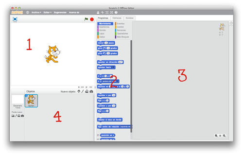

# COMO INTEGRAR LA ROBÓTICA EN EDUCACIÓN PRIMARIA. ([192320GE002](http://www.juntadeandalucia.es/educacion/portals/web/cep-ubeda/novedades/-/contenidos/detalle/abierto-plazo-de-solicitudes-para-curso-con-seguimiento-como-integrar-la-robotica-en-educacion-primaria))

## CEP Ubeda

## [https://github.com/javacasm/RoboticaPrimariaCEPUbeda](https://github.com/javacasm/RoboticaPrimariaCEPUbeda)

### José Antonio Vacas @javacasm

2,3,9,25 y 30 de Abril 2019

# Programación

[Cursos](http://www.programoergosum.com/cursos-online/robotica-educativa)

## Code.org

#### ¿no son todos .com?

#### ¿quién está detrás?

### Vamos a hacer pequeños programas para ayudar a nuestros amigos

### ¿Frozen? ¿Angry birds? ¿Flappy bird?

[nivel 1](https://studio.code.org/hoc/1/	)

## [Blocky](https://developers.google.com/blockly/)

## [Scratch](./Scratch.md)

## [AppInventor](./AppInventor.md)

## Ejemplos

[Retos para secundaria](http://www.aprendeprogramando.es/challenges)
